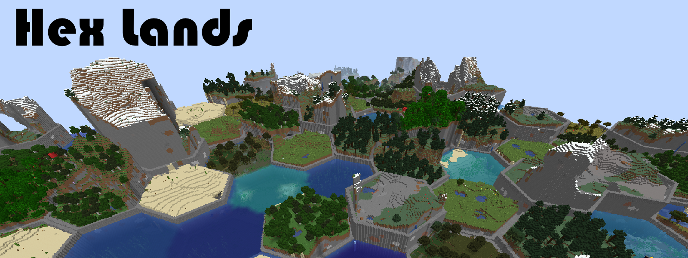
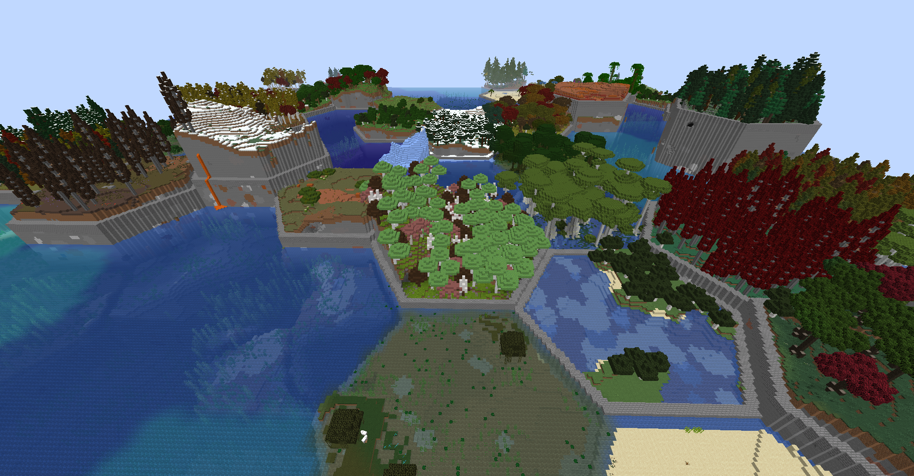

This mod is an updated and rewritten version of the original [Hex Lands](https://www.curseforge.com/minecraft/mc-mods/hex-lands) mod by superfluke, et. al. It has been re-done completely from scratch in Minecraft 1.16.5.

### Features

- Adds two world type presets: "HexLands", and "HexLands (Overworld)". The former which enables hexagonal terrain generation in both the overworld and the nether, the latter which only enables it in the overworld.
- Each hex contains a single biome. Hexes of different types are bordered by walls.
- Automatic compatibility with mods that add biomes to the overworld or other world generation.
- Many options for world customization via data packs.

### Data Packs

All of Hex Lands's world generation can be used by datapacks. If you're not familiar with world gen datapacks and custom dimensions, the following articles are useful to get up to speed:

- [Custom World Generation](https://minecraft.fandom.com/wiki/Custom_world_generation)
- [Custom Dimensions](https://minecraft.fandom.com/wiki/Custom_dimension)

In order to change a dimension to use hex based generation, you need to override the [dimension](https://minecraft.fandom.com/wiki/Custom_dimension#Dimension_syntax) json. For example, in the overworld, this would be `data/minecraft/dimension/overworld.json`. This is used in the `generator` field of a dimension json. It is an object, which has the following fields.

**Note**: Anywhere below where the term "default value" is used does not mean the field is not required! It means that is the value used by the Hex Land's generation presets.

- `type` is a string identifying what chunk generator to use. Must be `hexlands:hexlands`.
- `seed` is a `long`. It is the seed of the world. (This will be overriden by a seed in the world creation screen, or server.properties if not present.)
- `settings` is a [Noise Settings](https://minecraft.fandom.com/wiki/Custom_world_generation#Noise_settings) used by the dimension. The default value is `"minecraft:overworld"`.
- `biome_source` is an object representing the biomes in the world. It must be a Hex Lands biome source, with the following fields:
    - `type` is a string identifying what biome source to use. Must be `hexlands:hexlands`.
    - `seed` is a long. It is the seed used by the biome source. (This will be overriden by a seed in the world creation screen, or server.properties if not present.)
    - `biome_source` is the biome source used by the hexlands biomes. It can be any biome source in vanilla. The default one used is `minecraft:vanilla_layered`. This will include modded biomes if they add biomes to the normal overworld.
    - `biome_scale` is a double between `0.01` and `1000`. It represents the scale of the biomes in hexes. Lower values will make biomes closer together, larger values will create more adjacent hexes of the same biome. The default in the overworld is `8`, the default in the nether is `4`.
    - `hex_size` is a double between `1` and `1000` representing the size of a single hex. The default is `40`.
    - `hex_border_threshold` is a double between `0` and `1` representing how much of a hex should be covered by the border. Larger values will lead to thinner borders. The default is `0.92`.
    - `border_state` is a block state representing the border state. It must be specified in a block state format, with a `Name` and `Properties` keys. The default in the overworld is `minecraft:stone_bricks`, the default in the nether is `minecraft:nether_bricks`.
    - `border_extends_to_bedrock` is a boolean. If true, the border will extend all the way down to bedrock, rather than only covering the surface material. By default, this is `false` in the overworld and `true` in the nether.
    - `windowed_border` is a boolean. If true, the border will be a "window" from both the top and the bottom of the world, otherwise, it will approximate the height of the biome. By default, this is `false` in the overworld and `true` in the nether.
    - `no_border` is a boolean. If true, there will be no border, and the border space will completely consist of air.

#### Example

```json5
{
  "type": "minecraft:overworld", // Dimension Type
  "generator": {
    "type": "hexlands:hexlands", // Hex Lands generator
    "seed": 1234,
    "settings": "minecraft:overworld", // Noise settings
    "biome_source": {
      "type": "hexlands:hexlands", // Hex Lands biome source
      "seed": 1234,
      "biome_source": {
        "type": "minecraft:vanilla_layered", // The actual biome source used
        "seed": 1234,
        "large_biomes": false
      },
      "biome_scale": 8,
      "hex_size": 40,
      "hex_border_threshold": 0.92,
      "border_state": {
        "Name": "minecraft:stone_bricks",
        "Properties": {}
      },
      "border_extends_to_bedrock": false,
      "windowed_border": false,
      "no_border": false
    }
  }
}
```

### World Types

Hex Lands adds two world types. By default, it will overwrite the Forge config option for world types and set it to `hexlands:hexlands`. This can be disabled in the `hexlands-common.toml` config.

- `hexlands:hexlands` This is the default Hex Lands world type. It will use hex based terrain generation in the overworld and nether.
- `hexlands:hexlands_overworld_only` This will only use hex based terrain generation in the overworld.

To set the world type, consult the option in the `forge-common.toml` config file:

```toml
# Defines a default world type to use. The vanilla default world type is represented by 'default'.
# The modded world types are registry names which should include the registry namespace, such as 'examplemod:example_world_type'.
defaultWorldType = "hexlands:hexlands"
```

### Config

Hex Lands has one common config option:

```toml
# Should HexLands try and set the 'hexlands:hexlands' world type as the default world type?
# This will only replace the option in the respective Forge config file, *only* if it is set to 'default'
setHexLandsWorldTypeAsDefault = true
```

### Gallery


With [Oh The Biomes You'll Bo](https://www.curseforge.com/minecraft/mc-mods/oh-the-biomes-youll-go):




With [Biomes O Plenty](https://www.curseforge.com/minecraft/mc-mods/biomes-o-plenty)


