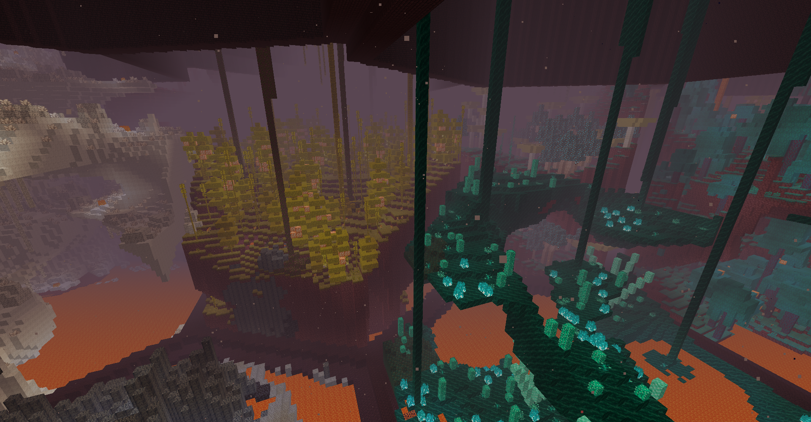

This mod is an updated and rewritten version of the original [Hex Lands](https://www.curseforge.com/minecraft/mc-mods/hex-lands) mod by superfluke, et. al. It has been re-done completely from scratch (three times now) since Minecraft 1.16.5.

### Features

- Adds two world type presets: "HexLands", and "HexLands (Overworld)". The former which enables hexagonal terrain generation in both the overworld and the nether, the latter which only enables it in the overworld.
- Each hex contains a single biome. Hexes of different types are bordered by walls.
- Automatic compatibility with mods that add biomes to the overworld or other world generation.
- Many options for world customization via data packs.

### Configuration (Data Packs)

All of HexLands's world generation can be used by datapacks. If you're not familiar with world gen datapacks and custom dimensions, the following articles are useful to get up to speed:

- [Custom World Generation](https://minecraft.fandom.com/wiki/Custom_world_generation)
- [Custom Dimensions](https://minecraft.fandom.com/wiki/Custom_dimension)

In order to change a dimension to use hex based generation, you need to override the [dimension](https://minecraft.fandom.com/wiki/Custom_dimension#Dimension_syntax) json. For example, in the overworld, this would be `data/minecraft/dimension/overworld.json`. This is used in the `generator` field of a dimension json. It is an object, which has the following fields.

**Note**: Anywhere below where the term "default value" is used does not mean the field is not required! It means that is the value used by the Hex Land's generation presets.

- `type` is a string identifying what chunk generator to use.
- `seed` is an integer. It is the seed of the world.
- `settings` is a [Noise Settings](https://minecraft.fandom.com/wiki/Custom_world_generation#Noise_settings) used by the dimension. The default value is `"minecraft:overworld"`.
- `hex_settings` is an object with parameters defining how the hexagonal grid works. It can have any of the following fields:
    - `biome_scale` (Default: 8) is the scale at which biomes are sampled to create hexes. Higher values create more random biome layouts.
    - `hex_size` (Default: 40) is the size of an individual hex.
    - `hex_border_threshold` (Default: 0.92) is a number between `0` and `1` representing how much of a hex should be covered by the border. Larger values will lead to thinner borders.
    - `top_border` and `bottom_border` are both border settings which define how the top and bottom borders of the world are built. The borders between hexes consist of a bottom border, air, and a top border. If not present, this section of the border will consist entirely of air. If present, it must have the following fields:
        - `min_height`: The minimum height of the border.
        - `max_height`: The maximum height of the border.
        - `state`: A block state to generate as the border state.
- `biome_source` is the biome source, as in vanilla.

### Gallery

With [Oh The Biomes You'll Bo](https://www.curseforge.com/minecraft/mc-mods/oh-the-biomes-youll-go):

With [Biomes O Plenty](https://www.curseforge.com/minecraft/mc-mods/biomes-o-plenty)

